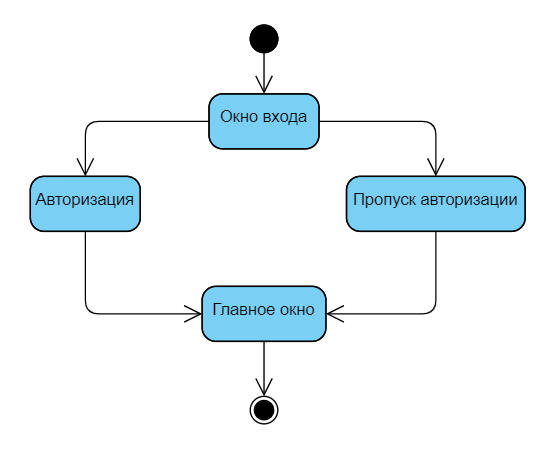

# Диаграммы состояний
---

# Содержание
1 [Мокапы окон](#window_mockups)    
2 [Войти в учётную запись](#sign_in)  
3 [Основные варианты состояний](#main_states)  

<a name="window_mockups"/>

## Окна
Используемые мокапы окон:
+ Окно входа: https://github.com/So-Sad/imdb-data-manager/blob/master/Documentation/Images/Mockups/signing_in.PNG   
+ Главное окно: https://github.com/So-Sad/imdb-data-manager/blob/master/Documentation/Images/Mockups/overall_news.PNG   

<a name="sign_in"/>

# Войти в учётную запись

<a name="main_states"/>

# Основные варианты состояний

