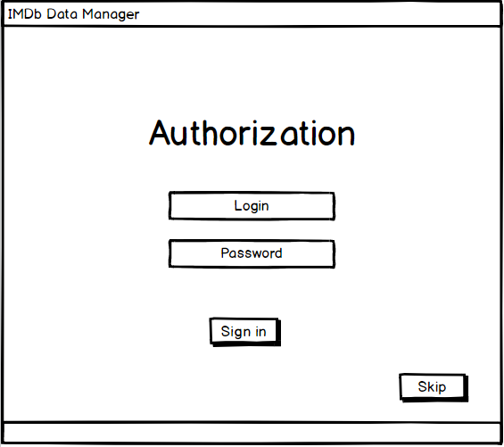
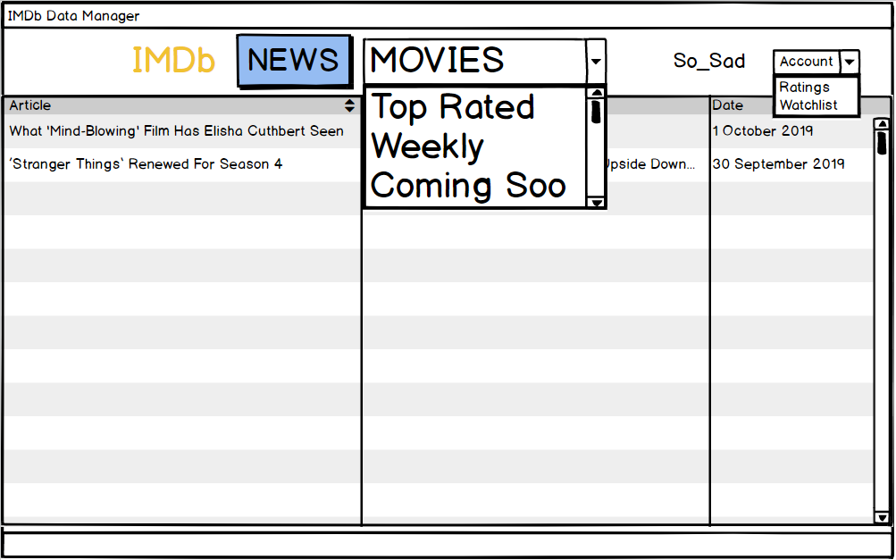
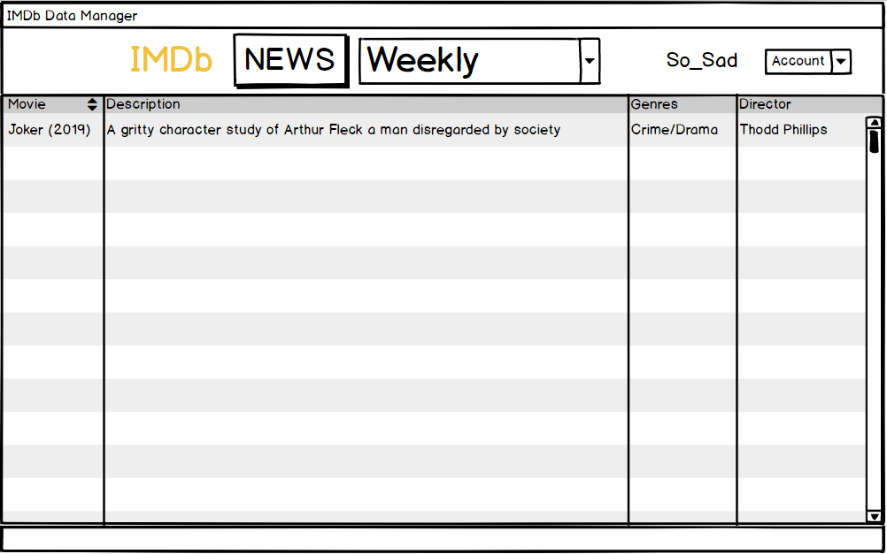
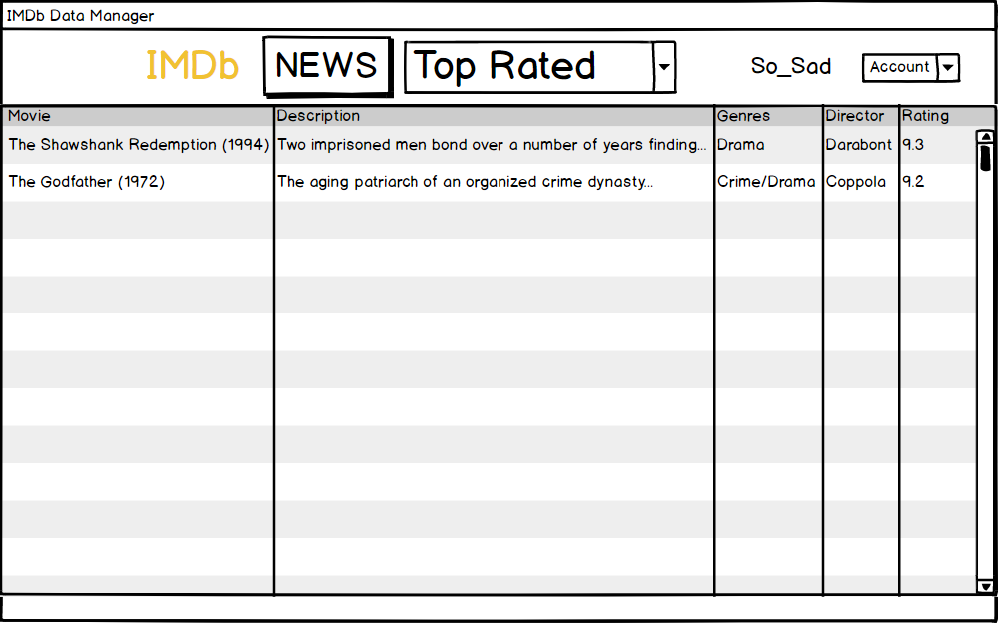
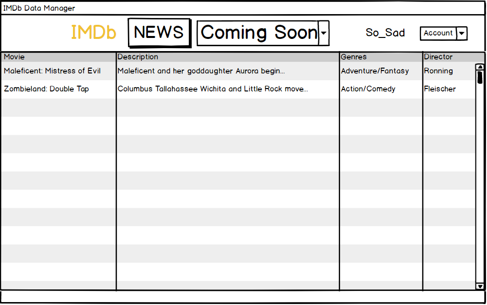
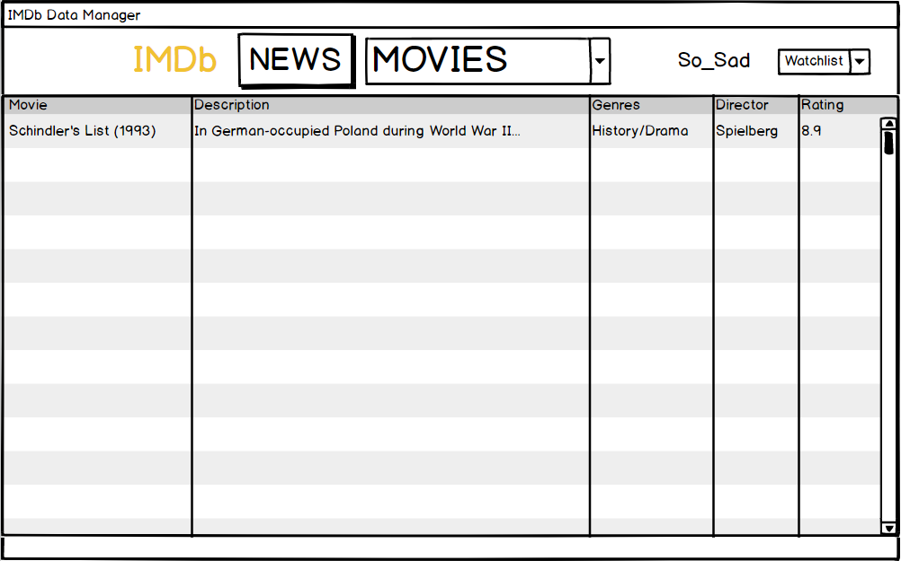
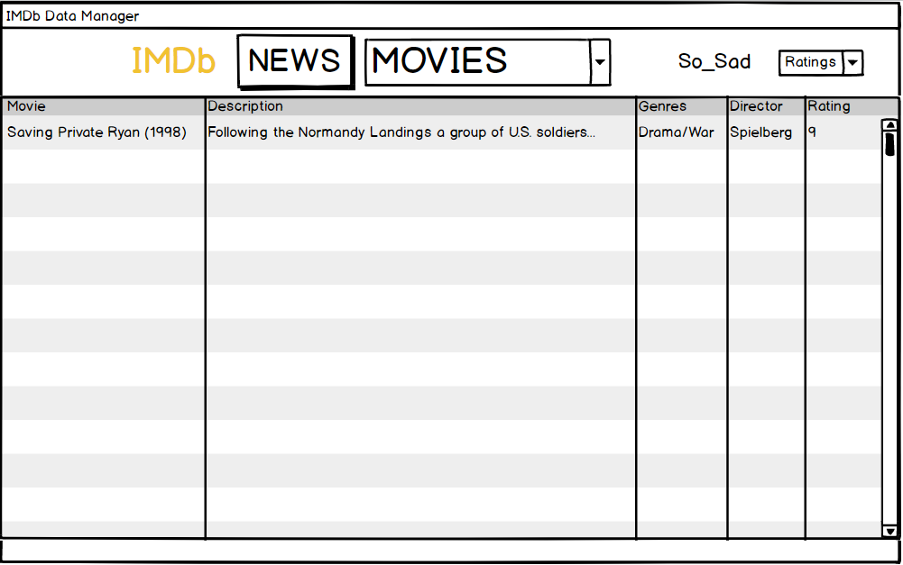

# Требования
***
# Содержание

1. [Введение](#intro)  
    1.1 [Назначение](#appointment)  
    1.2 [Бизнес-требования](#business_requirements)  
       1.2.1 [Исходные данные](#initial_data)  
       1.2.2 [Возможности бизнеса](#business_opportunities)  
       1.2.3 [Границы проекта](#project_boundary)  
    1.3 [Обзор аналогов](#analogues)  
2. [Требования пользователя](#user_requirements)  
  2.1 [Программные интерфейсы](#software_interfaces)  
  2.2 [Интерфейс пользователя](#user_interface)  
  2.3 [Характеристики пользователей](#user_specifications)  
    2.3.1 [Аудитория приложения](#application_audience)  
      2.3.1.1 [Целевая аудитория](#target_audience)  
      2.3.1.2 [Побочная аудитория](#collateral_audience)  
  2.4 [Предположения и зависимости](#assumptions_and_dependencies)  
3. [Системные требования](#system_requirements)  
  3.1 [Функциональные требования](#functional_requirements)  
    3.1.1 [Основные функции](#main_functions)   
        3.1.1.1 [Авторизация](#authorization)   
        3.1.1.2 [Просмотр общей информации](#overall_info)    
            3.1.1.2.1   [Просмотр новостей](#news_scope)    
            3.1.1.2.2   [Просмотр фильмов этой недели](#weekly_scope)   
            3.1.1.2.3   [Просмотр топ-чарта](#top_scope)   
        3.1.1.3 [Просмотр информации аккаунта](#account_info)   
            3.1.1.3.1   [Просмотр Watchlist'а аккаунта](#watchlist_scope)   
            3.1.1.3.2   [Просмотр рейтингов аккаунта](#ratings_scope)  
  3.2 [Нефункциональные требования](#non-functional_requirements)  
    3.2.1 [Атрибуты качества](#quality_attributes)  
      3.2.1.1 [Требования к удобству использования](#requirements_for_ease_of_use)  
      3.2.1.2 [Требования к безопасности](#security_requirements)  
    3.2.2 [Внешние интерфейсы](#external_interfaces)  
    3.2.3 [Ограничения](#restrictions)  

<a name="glossary"/>

## Глоссарий    
+   Вэб парсинг (от англ. parse - разбор, структурный анализ) - извлечение, сбор открытой информации с сайтов с целью ее дальнейшей обработки и преобразования. 
+   Скрэйпинг (от англ. scrape - скрести) - перенос Интернет-данных из html-страницы в некоторые хранилища (базы данных, файлы) и предоставление их в структурированном виде.   
+   API (Application Programming Interface) - интерфейс, предоставляющий регламентированные способы (например, готовые функции) для работы с определенным приложением или сайтом.   
+   Watchlist (wishlist) - список фильмов, которые пользователь захотел посмотреть позже.   
+   Топ (от англ. top - вершина) - список фильмов с наивысшим рейтингом пользователей.  
    
<a name="intro"/>

# Введение

<a name="appointment"/>

## Назначение
В этом документе описаны функциональные и нефункциональные требования к приложению «IMDb Data Manager» для ОС Windows 10. Этот документ предназначен для команды, которая будет реализовывать и проверять корректность работы приложения.

<a name="business_requirements"/>

## Бизнес-требования

<a name="initial_data"/>

### Исходные данные
Аудитория сервиса IMDb очень обширна, так как он предоставляет большое количество информации, связанной с фильмами, актерами и сопутствующими темами. Как и любому сайту, сервису свойственны  реклама, большое количество пестрых заголовков и обширные пласты данных. Где-то они структурированны, а где-то нет, одни пользователю нужны, а другие нет, и так далее. Так же сайт может предоставлять платный контент, и не всегда приятно, когда на каждом шагу нам об этом упоминают. Прибавляя к вышеперечисленному не слишком интуитивную навигацию, некоторые консервативные пользователи будут вынуждены выходить из зоны комфорта при пользовании сервиса.

<a name="business_opportunities"/>

### Возможности бизнеса
Данное приложение поможет разрешить поднятые выше неудобства пользования сайтом www.imdb.com. То есть реализуется грамотная структуризация полученной информации, нативный интерфейс, предоставляются только необходимые данные, отсутствует реклама. Все это делает приложение привлекательным и удобным в использовании.  

<a name="project_boundary"/>

### Границы проекта
Данное приложение позволит нам просматривать предоставляемую IMDb информацию в удобном для пользователя виде без рекламы и лишней информации.

<a name="analogues"/>

## Обзор аналогов
Существует много мелких проектов по обертке API IMDb и парсингу сайта, есть официальное мобильное приложение, но нет как таковых структурированных десктопных приложений по предоставлению данных.    

<a name="user_requirements"/>

# Требования пользователя

<a name="software_interfaces"/>

## Программные интерфейсы
Приложение парсит html-данные с сайта www.imdb.com, а также получает необходимую информацию с помощью IMDb API. 

<a name="user_interface"/>

## Интерфейс пользователя
Окно авторизации    
    
Окно с общей информацией, вкладка "News", а также возможные вкладки для других параметров     
 
Окно с общей информацией, вкладка "Weekly"      
 
Окно с общей информацией, вкладка "Top Rated"      
 
Окно с общей информацией, вкладка "Coming Soon"      
 
Окно с информацией аккаунта, вкладка "Watchlist"     
   
Окно с информацией аккаунта, вкладка "Ratings"     
 

<a name="user_specifications"/>

## Характеристики пользователей

<a name="application_audience"/>

### Аудитория приложения

<a name="target_audience"/>

#### Целевая аудитория
Люди средней возрастной категории, желающие получить лучший эффект пользования сервисом IMDb, обладающие минимальной технической грамотностью.

<a name="collateral_audience"/>

#### Побочная аудитория
Люди других возрастных категорий с теми же качествами.

<a name="assumptions_and_dependencies"/>

## Предположения и зависимости
Приложение не работает при отсутствии выхода в Интернет.

<a name="system_requirements"/>

# Системные требования

<a name="functional_requirements"/>

## Функциональные требования

<a name="main_functions"/>

### Основные функции
Основной функционал - парсинг html-кода и скрэйпинг данных с помощью IMDb API.

<a name="authorization"/>

#### Авторизация
**Описание.** Пользователь имеет возможность просмотреть данные своей учетной записи на сайте IMDb. Также возможна псевдоавторизация, когда будут предоставляться данные по ID любого известного пользователя.  
**Требования.** Приложение должно иметь возможность входа пользователя или получения его ID, а затем предоставить данные аккаунта.  

<a name="overall_info"/>

#### Просмотр общей информации

<a name="news_scope"/>

##### Просмотр новостей
**Описание.** Пользователь имеет возможность просмотреть данные сайта IMDb касательно текущих новостей в мире кино.     
**Требования.** Приложение должно получать данные о новостях с сервиса IMDb.    

<a name="weekly_scope"/>

##### Просмотр фильмов этой недели
**Описание.** Пользователь имеет возможность посмотреть данные сайта IMDb касательно премьер этой недели.   
**Требования.** Приложение должно получать данные о фильмах этой неделе с сервиса IMDb. 

<a name="top_scope"/>

##### Просмотр топ-чарта
**Описание.** Пользователь имеет возможность посмотреть данные сайта IMDb касательно топ-чарта кино за все время.   
**Требования.** Приложение должно получать данные о топе фильмов за все время с сервиса IMDb.   

<a name="account_info"/>

#### Просмотр информации аккаунта

<a name="watchlist_scope"/>

##### Просмотр Watchlist'a аккаунта
**Описание.** Пользователь имеет возможность посмотреть данные аккаунта с сайта IMDb касательно вашей категории "Посмотреть позже".     
**Требования.** Приложение должно получать данные о вашей категории "Посмотреть позже" с сервиса IMDb.  

<a name="ratings_scope"/>

##### Просмотр рейтингов аккаунта
**Описание.** Пользователь имеет возможность посмотреть данные сайта IMDb касательно ваших оценок фильмов.  
**Требования.** Приложение должно получать данные о ваших оценках фильмов с сервиса IMDb.      

<a name="non-functional_requirements"/>

## Нефункциональные требования

<a name="quality_attributes"/>

### Атрибуты качества

<a name="requirements_for_ease_of_use"/>

#### Требования к удобству использования
+   Все функциональные элементы пользовательского интерфейса имеют названия, описывающие действие, которое произойдет при выборе элемента.
+   Простой и наглядный интерфейс 

<a name="security_requirements"/>

#### Требования к безопасности
Неавторизированным пользователям будут недоступны некоторые функции, в частности, просмотр информации о персональных рейтингах и watchlist аккаунта.    

<a name="external_interfaces"/>

### Внешние интерфейсы
Окна и вкладки приложения интуитивно понятны пользователям, доступно отображают всю необходимую информацию.

<a name="restrictions"/>

### Ограничения
Необходимы JRE и Java SDK 1.8
